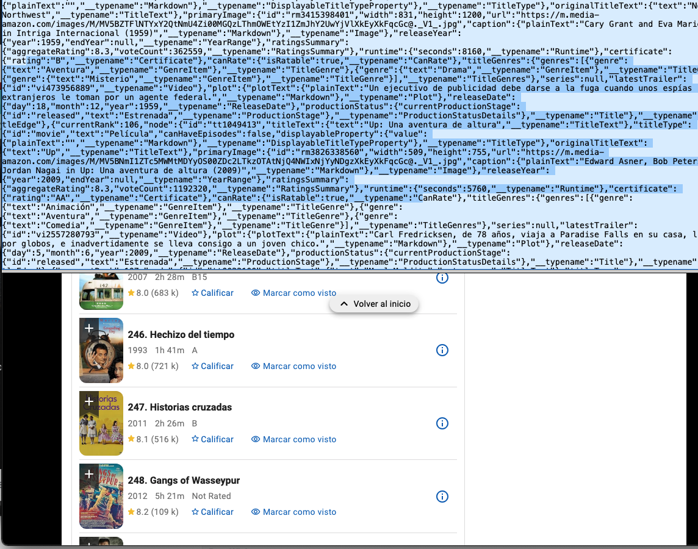
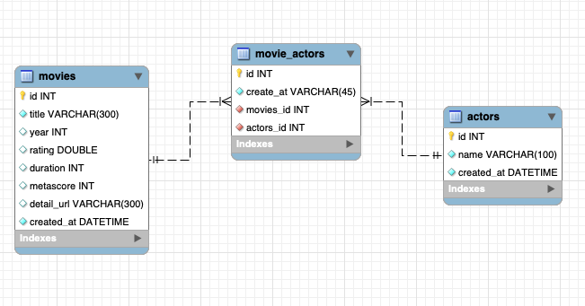
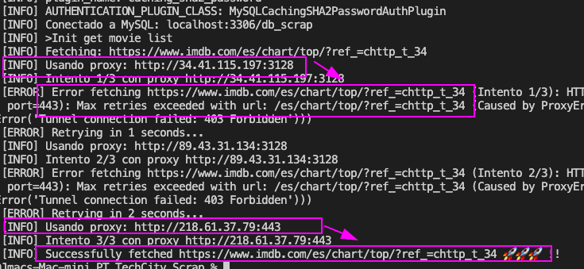
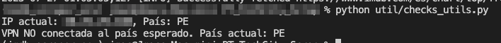

# 🎬 IMDb Top Movies Scraper - Arquitectura Limpia y Modular

[](https://github.com/usuario/repo/releases) [](https://opensource.org/licenses/MIT) [](https://github.com/usuario/repo/actions)<br>**by [Javier Solis 🧑‍💻🤖🚀🎯🔍](#contact)**

Un _scraper_ robusto y escalable diseñado para extraer información detallada de las películas más valoradas de IMDb. Este proyecto ha sido desarrollado siguiendo principios de **Arquitectura Limpia (Clean Architecture)**, el patrón **Page Object Model (POM)** y el **Factory Pattern**, viendo por la modularidad, reusabilidad y fácil mantenimiento.

### 📄 Tabla de Contenidos

1.  [📦 Entregables](#-entregables)
2.  [💡 Solución Propuesta](#solución-propuesta)
    - [1️⃣ Arquitectura y Decisiones Técnicas del Scraper Inicial](#1️⃣-arquitectura-y-decisiones-técnicas-del-scraper-inicial)
    - [2️⃣ Persistencia y Análisis de Datos](#2️⃣-persistencia-y-análisis-de-datos)
    - [3️⃣ Proxies y Control de Red](#3️⃣-proxies-y-control-de-red)
    - [4️⃣ Comparación Técnica: Selenium o Playwright](#4️⃣-comparación-técnica-selenium-o-playwright)
3.  [🚀 Instalación](#-instalación)
4.  [🎯 Uso](#-uso)
5.  [Organización del proyecto](#organización-del-proyecto)
6.  [Contact](#contact)

# 📦 Entregables

Se han preparado los siguientes entregables:

## **Repositorio en GitHub:**

- https://github.com/JavierSolis/pt_scrap_imdb_07251630

## **- Script SQL con creación de tablas, vistas, índices y consultas analíticas:**

- `entregables/create.sql` (Creación de tablas)
- `entregables/vistas.sql`
- `entregables/indices.sql`
- `entregables/consultas_analiticas.sql`

## **Archivo CSV Generado:**

- `/data/imdb_top_movies.csv`

## **README Detallado:**

- `README.md`

## **Colaboradores de GitHub:**

- Se han invitado a los siguientes usuarios de GitHub:
  - `tc-kespejo`
  - `tc-lraigoso`
  - `sneira5`

# Solución propuesta

## 1️⃣ Arquitectura y Decisiones Técnicas del Scraper Inicial

En esta sección, se detalla la fase de concepción y el diseño inicial del _scraper_ para la recopilación de películas top de IMDb.

- **Fase de Prueba de Concepto (POC):**

  - Se inició con una prueba de concepto (PoC), cuyos archivos iniciales se encuentran en la carpeta `POC/`.
  - Posteriormente, esta PoC fue refactorizada para organizar el código en capas claras y aplicar principios de arquitectura de software.

- **Configuración y Orquestación:**

  - Se implementó el archivo `config.py` para gestionar parámetros configurables del _scraper_. Inicialmente, esto incluyó la cantidad de películas y actores a procesar, permitiendo pruebas más rápidas y mitigando el riesgo de saturar el sitio objetivo o incurrir en un bloqueo temprano.
  - El archivo `main.py` actúa como orquestador principal del flujo de _scraping_. Utilizando el patrón **Page Object Model (POM)**, `main` coordina las llamadas a los diferentes métodos: primero, obtiene la lista de películas top; luego, extrae los detalles específicos de cada película; y finalmente, persiste los datos en archivos CSV y en una base de datos SQLite.
  - Se creó un módulo utilitario dedicado para la gestión de logs, facilitando el seguimiento y la depuración del proceso.
  - Se incorporó un **`random delay`** entre las solicitudes de detalle de películas, para simular el comportamiento humano y reducir la probabilidad de detección como _bot_.

- **Diseño del Scraper (Patrón POM):**

  - Se definió una clase abstracta `BasePage`. Esta clase encapsula la lógica común para el manejo del `BeautifulSoup` (`soup`) y la invocación de un `FetchFactory`, lo que permite una futura flexibilidad para cambiar el método de obtención de datos (ej. de `requests` a otra librería).
  - Basándose en el patrón POM, se crearon dos clases concretas: `Home` (para la página principal/listado) y `Detail` (para las páginas de detalle de cada película), ambas heredando de `BasePage`.

- **Persistencia de Datos (Patrón Repository):**

  - Para el almacenamiento de los datos extraídos, se aplicó el patrón **Repository**.
  - Se definió una interfaz `BaseRepository` que establece el contrato para las operaciones de guardado.
  - Actualmente, se tienen implementaciones concretas para guardar los datos en un **archivo CSV** y en una **base de datos SQLite**, demostrando la flexibilidad para persistir en múltiples destinos.
  - Para facilitar las pruebas y asegurar un estado limpio en cada ejecución, se asumió que los repositorios (`CSV` y `SQLite`) deben **resetearse en cada iteración** del _scraper_.

- **Esquema de Base de Datos:**

  - La base de datos SQLite utiliza tres tablas para almacenar la información: `movies`, `movie_actor` y `actor`.
  - Esta estructura refleja una relación N:M (muchos a muchos) entre películas y actores, permitiendo que un actor participe en múltiples películas.
  - Se decidió comparar las entidades (ej. actores) por su nombre en lugar de la URL.

- **Análisis y Solución para la Obtención de Datos Completos:**

  - Al realizar pruebas para obtener 50 películas de la lista top, se observó que el _scraper_ solo recuperaba 25. Una investigación reveló que IMDb inicialmente renderiza 25 elementos en el HTML y los 225 restantes se cargan dinámicamente o están precargados en el DOM para una visualización instantánea mediante **GraphQL** o JSON embebido.
  - Se evaluaron las siguientes soluciones para obtener el conjunto completo de 250 películas:

    - **Apuntar directamente a la API GraphQL:** Sería la forma más limpia y eficiente de obtener datos estructurados.
    - **Utilizar el JSON embebido:** El HTML del contenedor principal de la lista de películas contiene un `div` con datos JSON (`<div class="__next" data-imdb-state='{"data":{"titleList"....}}'>`). Este JSON contiene los datos de las 250 películas.
    - **Explorar opciones de paginación:** Verificar si la página ofrece parámetros de paginación en la URL o botones de "siguiente página".

  - **Decisión para la prueba:**
    - Aunque la opción GraphQL sería la ideal por la limpieza de los datos, la prueba técnica se enfoca en el uso de **BeautifulSoup** y **Requests** (o técnicas de _scraping_ basadas en HTML estático).
    - Por lo tanto, se optará por **obtener los datos del JSON embebido en el HTML** (`data-imdb-state` del `div`). Esto requerirá una refactorización de la clase `Home` para extraer la información de las películas de este JSON. Las demás partes del _scraper_ (como la obtención de detalles y el guardado) no deberían verse afectadas, lo que valida la ventaja de la separación de responsabilidades.
  -  _(Captura de pantalla ilustrativa del JSON embebido en el HTML)_

## --

## 2️⃣ Persistencia y Análisis de Datos

Esta sección describe cómo se maneja el almacenamiento de los datos extraídos y las consultas analíticas implementadas para extraer valor de la información recopilada.

- **Diseño del Modelo Entidad-Relación (MER):**

  - Se diseñó un Modelo Entidad-Relación para representar la estructura de la base de datos, para tenerlo claro y realziar un mejor análisis.
  -  _(Diagrama visual del Modelo Entidad-Relación de la base de datos.)_

- **Implementación de la Base de Datos:**

  - Se implementó un nuevo repositorio dedicado a **MySQL**, replicando la lógica de persistencia ya existente para SQLite. Esto permite un cambio de motor de base de datos sin afectar la lógica de negocio principal del _scraper_.

- **Consultas SQL Solicitadas:**

  1.  **Obtener las 5 películas con mayor promedio de duración por década.**

      ```sql
      WITH RankedMovies AS (
          SELECT
              title,
              year,
              duration,
              FLOOR(year / 10) * 10 AS decada,
              ROW_NUMBER() OVER (PARTITION BY FLOOR(year / 10) * 10 ORDER BY duration DESC) AS rn
          FROM
              movies
      )
      SELECT
          title,
          year,
          duration,
          decada
      FROM
          RankedMovies
      WHERE
          rn <= 5;
      ```

  2.  **Calcular la desviación estándar de las calificaciones por año.**

      ```sql
      SELECT
          year,
          round(STDDEV(rating),2) AS std_dev
      FROM
          movies
      GROUP BY
          year
      order by year;
      ```

  3.  **Detectar películas con más de un 20% de diferencia entre calificación IMDB y Metascore (normalizado).**
      _Consideración:_ Se observó que el _rating_ de IMDb se presenta en una escala de 0 a 10, mientras que el Metascore va de 0 a 100. Para una comparación justa, el Metascore se ha normalizado dividiéndolo por 10.

      ```sql
      SELECT
        title,
        year,
        detail_url,
        rating,
        metascore,
        ROUND(ABS(rating - metascore / 10), 2) AS diferencia,
        ROUND(ABS(rating - metascore / 10) / rating * 100, 2) AS diferencia_porcentual
      FROM
        movies
      WHERE
        rating IS NOT NULL
        AND metascore IS NOT NULL
        AND rating IS NOT NULL
        AND ABS(rating - metascore / 10) / rating > 0.20
      ORDER BY diferencia_porcentual
      ```

  4.  **Crear una vista que relacione películas y actores, y permita filtrar por actor principal.**
      _Consideración:_ Dado que no hay un campo explícito que indique al "actor principal" en la página de IMDb ni en la estructura de datos obtenida, se asume para esta consulta que **el primer actor en la lista asociada a una película es el actor principal.**

      ```sql
      CREATE VIEW vista_peliculas_actor_principal AS
      SELECT
      m.id AS movie_id,
      m.title,
      a.id AS actor_id,
      a.name AS actor_name
      FROM (
      SELECT
          ma.movies_id,
          ma.actors_id,
          ROW_NUMBER() OVER (PARTITION BY ma.movies_id ORDER BY ma.actors_id) AS orden
      FROM movie_actors ma
      ) sub
      JOIN movies m ON m.id = sub.movies_id
      JOIN actors a ON a.id = sub.actors_id
      WHERE sub.orden = 1;
      -- Consulta de prueba
      -- SELECT * FROM vista_peliculas_actor_principal;
      ```

  5.  **Crear un índice o partición si se justifica para consultas frecuentes.**
      _Justificación:_ Se identificó una necesidad frecuente(para mi que con esta data ahora vere que peliculas deseo ver) de consultar películas por su calificación y año (ej., para una aplicación que muestre las mejores películas por fecha). Para optimizar el rendimiento de estas consultas, se creó un índice.

      ```sql
      SELECT title, year, detail_url, rating FROM movies ORDER BY rating DESC, year;
      -- Creación del índice
      CREATE INDEX idx_rating_year ON movies (rating DESC, year);
      -- Tiempos de ejecución comparativos:
      -- Antes del índice   : 0.001749 segundos
      -- Después del índice : 0.001044 segundos
      ```

## 3️⃣ Proxies y Control de Red

Esta sección aborda la implementación de estrategias robustas para la gestión de la red y el uso de proxies, cruciales para evitar bloqueos durante el _scraping_.

- **A. Uso de proxies rotativos (mínimo 3 IPs), configurados con reintentos y _fallback_ automático.**
  - Se aprovechó el patrón Strategy, previamente establecido para el mecanismo de _fetch_, para implementar una estrategia de obtención de datos con rotación de proxies.
  - La clase `RotativeFetchStrategy` encapsula la lógica para gestionar un conjunto de proxies, asegurando reintentos y un _backoff_ exponencial en caso de fallos.

```python
    class RotativeFetchStrategy(FetchStrategy):
        """Estrategia con proxy rotativo con reintentos y backoff exponencial"""

        """
        218.61.37.79 443 China 660 ms
        34.41.115.197 3128 United States Council Bluffs 700 ms
        89.43.31.134 3128 Turkey 420 ms
        """

        proxies = [
            {"proxy":"http://34.41.115.197:3128","used":False},
            {"proxy":"http://89.43.31.134:3128","used":False},
            {"proxy":"http://218.61.37.79:443","used":False}
        ]

        ...
                custom_proxy = {
                    "http": proxy_url,
                    "https": proxy_url
                }
                log_info(f"Intento {i+1}/{retries} con proxy {proxy_url}")

                response = requests.get(
                    url,
                    proxies=custom_proxy,
                    headers=HEADERS,
                    timeout=SCRAPING_CONFIG['timeout'],
                    cookies=cookies
                )
```

- **Demostración de Funcionalidad:** Las pruebas realizadas con esta implementación confirman que, al detectar un error con el proxy en uso, el sistema cambia automáticamente a otro proxy disponible en la lista, logrando obtener los datos deseados.

  -  *(Captura de pantalla del log mostrando la rotación y el *fallback* de proxies.)*
  - **Mejora Identificada:** Actualmente, la estrategia asigna un proxy diferente por cada solicitud individual. Una mejora futura podría implementar un mecanismo para mantener el mismo proxy durante una sesión.

- **B. Integración con una VPN real mediante Docker, incluyendo un 'healthcheck' para validar la conexión al país requerido.**
  - Dada la restricción de tiempo en esta prueba, la integración completa de una VPN real mediante Docker no se ha implementado en este proyecto. Sin embargo, poseo experiencia en el uso de Docker y comprendo el proceso para crear una imagen personalizada, instalar las librerías necesarias para el cliente VPN (ej., OpenVPN o WireGuard) y configurar el enrutamiento del tráfico del contenedor a través de la VPN. Un ejemplo de implementación de proyectos con Docker puede verse en el repositorio: [https://github.com/JavierSolis/php-ddd-example](https://github.com/JavierSolis/php-ddd-example).
  - **Mecanismo de Healthcheck:** Para validar que la conexión VPN se ha establecido correctamente y que la IP de salida corresponde al país deseado, se puede utilizar un script de verificación. Este script podría ejecutarse como parte del proceso de inicio del contenedor Docker o ser invocado dentro de la lógica del _fetcher_ antes de cada serie de solicitudes.
  - Adjunto una prueba conceptual del script de verificación de la conexión VPN:

```python
   def check_vpn_connection(expected_country="US"):
       try:
           response = requests.get("http://ip-api.com/json/", timeout=5)
           data = response.json()
           current_ip = data.get("query")
           current_country = data.get("countryCode")
           print(f"IP actual: {current_ip}, País: {current_country}")
           if current_country == expected_country:
               print(f"VPN conectada correctamente al país esperado ({expected_country}).")
               return True
           else:
               print(f"VPN NO conectada al país esperado. País actual: {current_country}")
               return False
       except requests.exceptions.RequestException as e:
           print(f"No se pudo verificar la conexión VPN: {e}")
           return False
```

-  _(Captura de pantalla de la ejecución del script de verificación del país de la VPN.)_

- **C. Simulación con red TOR o proxies públicos, con rotación controlada.**
  - La implementación de proxies rotativos (descrita en el punto "A") ya cubre los requisitos de simulación con rotación controlada de IPs, ya sea a través de proxies públicos o, conceptualmente, la misma lógica aplicaría a TOR.
  - La evidencia de esta funcionalidad, incluyendo la indicación de la IP utilizada en cada solicitud, el registro de fallos y la demostración del cambio automático al siguiente proxy en caso de bloqueo, ha sido adjuntada previamente en la captura de pantalla del log bajo el punto "A".

---

### 4️⃣ Comparación Técnica: Selenium o Playwright

La comparación se centrará principalmente en **Selenium**, con el cual tengo mayor experiencia práctica.

Repositorio donde lo use para QA con Docker:
https://gitlab.com/abstractapt/Store/

- **Configuración avanzada de navegador (headless, headers, evasión de webdriver):**

  - **Modo Headless:** Selenium permite ejecutar el navegador en modo _headless_ (sin interfaz gráfica), lo que es ideal para entornos de servidor, tareas en segundo plano y despliegues en contenedores Docker, ya que no requiere un entorno visual. Esto optimiza el consumo de recursos.
  - **Personalización de Headers:** La capacidad de configurar opciones del navegador Chrome me permite personalizar cabeceras HTTP de las peticiones.
  - **Evasión de Detección de WebDriver:** Es posible implementar diversas técnicas para evitar la detección por parte de los sitios web. Al configurar el navegador (ej., modificando propiedades JavaScript, opciones del navegador, plugins, etx.), puedo simular un comportamiento más humano y sortear las defensas anti-bot que buscan comportamientos de automatización.

- **Selectores dinámicos con espera explícita:**

  - A diferencia de Beautiful Soup, que solo ve el HTML inicial, Selenium interactúa con el DOM completo después de la ejecución de JavaScript.
  - La capacidad de **espera explícita** . Permite al _scraper_ esperar de forma inteligente según exploremos la web objetivo hasta que un elemento específico sea visible, clickeable o esté presente en el DOM. Esto resuelve problemas comunes en sitios modernos (como el observado en IMDb Top 250 donde no todos los elementos aparecen de inmediato) y evita errores por elementos no cargados.
  - [Ejemplo de espera explícita en proyecto de QA con Selenium/JS](https://gitlab.com/abstractapt/Store/-/blob/master/pages/CartPage.js?ref_type=heads#L9-20)

- **Manejo de CAPTCHA o JavaScript Rendering:**

  - **JavaScript Rendering:** Al operar sobre un navegador real, Selenium ejecuta JavaScript de forma nativa. Asi cualquier contenido generado o modificado por JS será visible y accesible para el _scraper_.
  - **Manejo de CAPTCHA:** Si bien Selenium no resuelve CAPTCHAs automáticamente, permite la integración con servicios de terceros (ej., 2Captcha, Anti-Captcha, Kill Captcha). La estrategia consiste en detectar la presencia del CAPTCHA, obtener su identificador del formulario, enviarlo al servicio de resolución, esperar la respuesta, e inyectar el valor resultante en el campo correspondiente del formulario para sortear la validación.

- **Control de concurrencia (workers / colas):**

  - Aunque no he implementado explícitamente el control de concurrencia para _scrapers_ en Python usando Selenium, sí tengo experiencia en la gestión de concurrencia en otros lenguajes como Java y C#. La implementación en Python seguiría principios similares, utilizando módulos como `threading` o `multiprocessing`, junto con estructuras de datos como `Queue` ( Colas en laravel, Servicios de amazon) y mecanismos de sincronización (semáforos) para controlar el número de navegadores concurrentes y gestionar una cola de tareas.

- **Justificación del uso de estas herramientas vs Scrapy:**
  - No he utilizado Scrapy directamente, pero me he documentado sobre sus capacidades (referencia: [https://docs.scrapy.org/en/latest/faq.html](https://docs.scrapy.org/en/latest/faq.html)).
  - **Elección de Selenium (o Playwright) por versatilidad:**
    - Aunque Scrapy es un _framework_ potente y muy eficiente para sitios web estáticos o semi-estáticos, mi elección recae en Selenium por su **versatilidad al quere ser dinámicos** o usarse con mas herramientas según he necesitado.
    - La mayoría de los sitios modernos, como IMDb, dependen de JavaScript para cargar y renderizar contenido. Scrapy, por sí solo, no ejecuta JavaScript, lo que lo limita a lo que está disponible en el HTML inicial.
    - Selenium, al ser un navegador real, ejecuta el JavaScript, permitiendo al _scraper_, interactuar con elementos, manejar sesiones complejas, y adaptarse a cambios de UI. Esta flexibilidad me proporciona más opciones para obtener los datos en un entorno web.
    - Además, Selenium se integra bien con otras herramientas y configuraciones de navegador, lo que facilita la evasión de detecciones y la simulación de un comportamiento más humano.

## 🚀 Instalación

### 1. Clona el repositorio:

```bash
git clone <repository-url>
cd PT_TechCity_Scrap
```

### 2. Instala las dependencias:

```bash
pip install -r requirements.txt
```

## 🎯 Uso

### Ejecución básica

```bash
python main.py
```

### Para el check del vpn

```bash
python util/checks_utils.py
```

### Configuración personalizada

Puedes modificar la configuración en `config.py`:

> 💡 Según en que ambiente se despliegue convendría mover todo a un archivo de variables de entorno

```python
# URLs
IMDB_BASE_URL = "https://www.imdb.com"
IMDB_TOP_MOVIES_URL = f"{IMDB_BASE_URL}/chart/top/"

# Headers para requests
HEADERS = {
    ...
}

# Cookies personalizadas para evitar bloqueos
CUSTOM_COOKIES = {
    ...
}

# Configuración de scraping
SCRAPING_CONFIG = {
    'max_movies': 200,  # Número máximo de películas a extraer
    'retries': 3,      # Número de reintentos para requests
    'timeout': 10,     # Timeout para requests en segundos
    'delay_min': 1,    # Delay mínimo entre requests (segundos)
    'delay_max': 3,    # Delay máximo entre requests (segundos)
    'max_actors': 30,   # Número máximo de actores a extraer por película
}


# Configuración de logging
LOGGING_CONFIG = {
  ...
}
```

Para modificar el modo de hacer los request se puede agregar siguiendo patron factory en fetch_factory.py

```python
...
class FetchFactory:
    """Factory para crear estrategias de fetching"""

    @staticmethod
    def create_fetch_strategy(strategy=STANDARD_STRATEGY):
        if strategy == ROTATIVE_STRATEGY:
            return RotativeFetchStrategy()
        elif strategy == STANDARD_STRATEGY:
            return StandardFetchStrategy()
        else:
            raise ValueError(f"Estrategia desconocida: {strategy}")
...
```

## Organización del proyecto

```bash
tree -L 4
.
├── POC
│   ├── data.json
│   ├── data_exporter.py
│   ├── html_top.html
│   └── scraper_imdb.py
├── _file
│   ├── MER.mwb
│   └── create.sql
├── config.py
├── data
│   ├── backup__scrap.sql
│   ├── imdb_movies.db
│   └── imdb_top_movies.csv
├── entregables
│   ├── create.sql
│   └── vistas.sql
├── factories
│   └── fetch_factory.py
├── main.py
├── pages
│   ├── base_page.py
│   ├── imdb_detail_page.py
│   └── imdb_home_page.py
├── readme.md
├── repositories
│   ├── base_repository.py
│   ├── csv_repository.py
│   ├── mysql_repository.py
│   └── sqlite_repository.py
├── requirements.txt
├── tasks.md
└── util
    ├── checks_utils.py
    ├── converter_utils.py
    ├── logging_utils.py
    └── soup_utils.py

```

---

# Contact

<div align="center">
    
   

#### Javier Solis

👓 https://www.linkedin.com/in/android-developer-peru/

💼 https://www.behance.net/JavierJSolis

</div>
